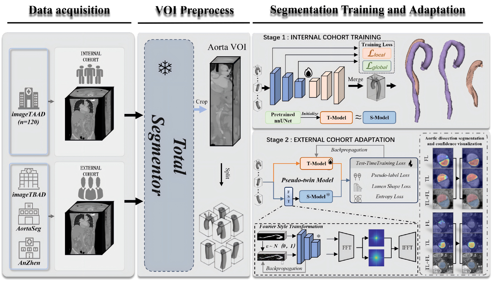
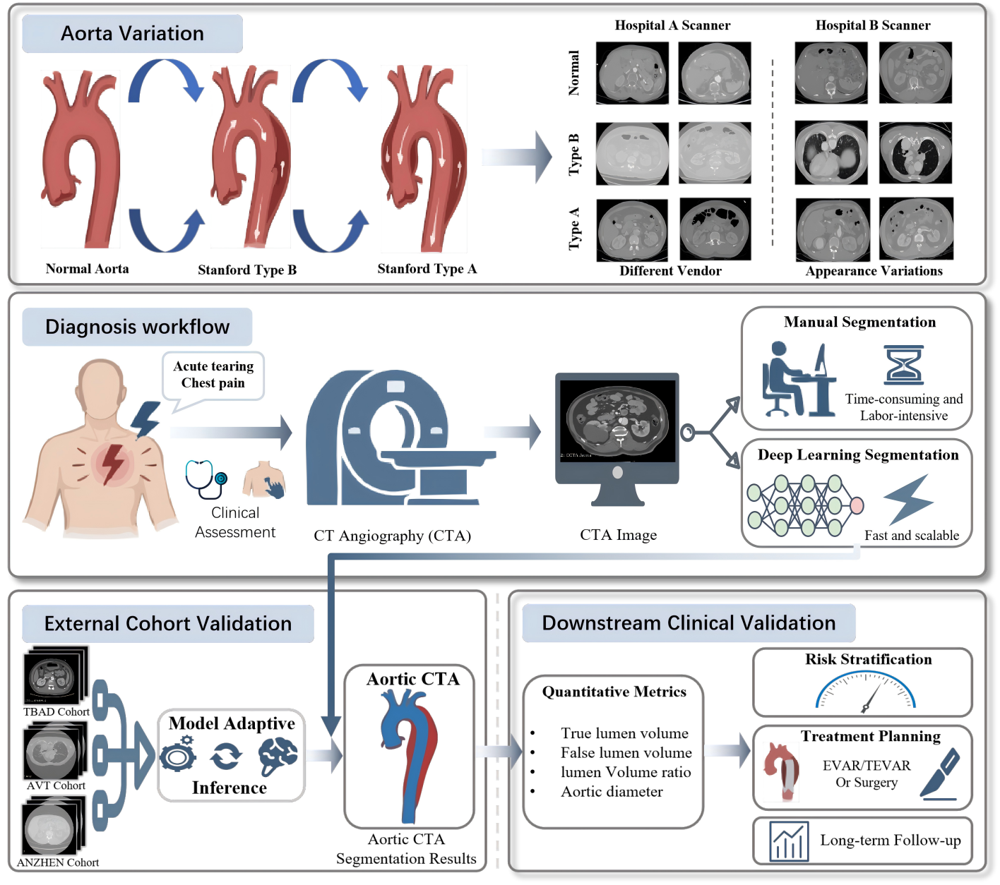
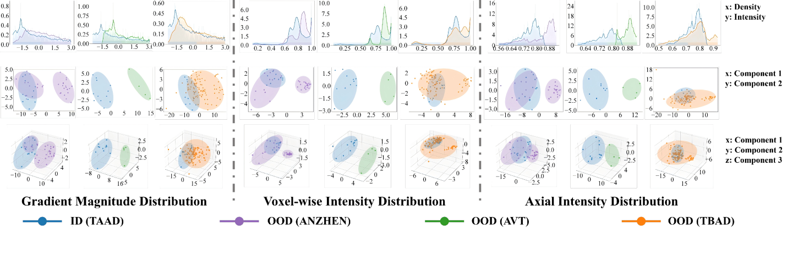
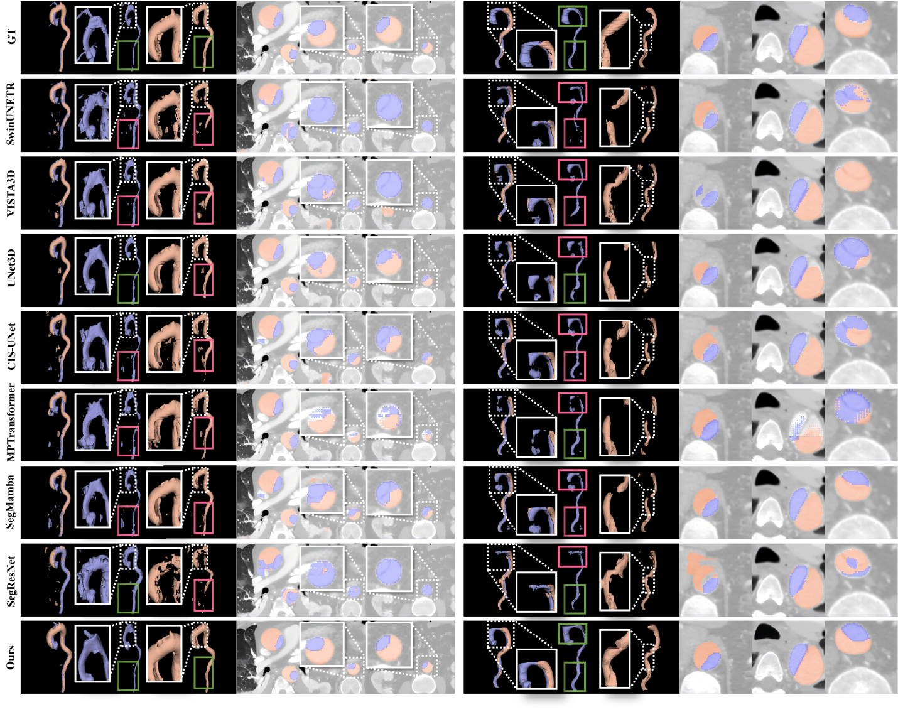
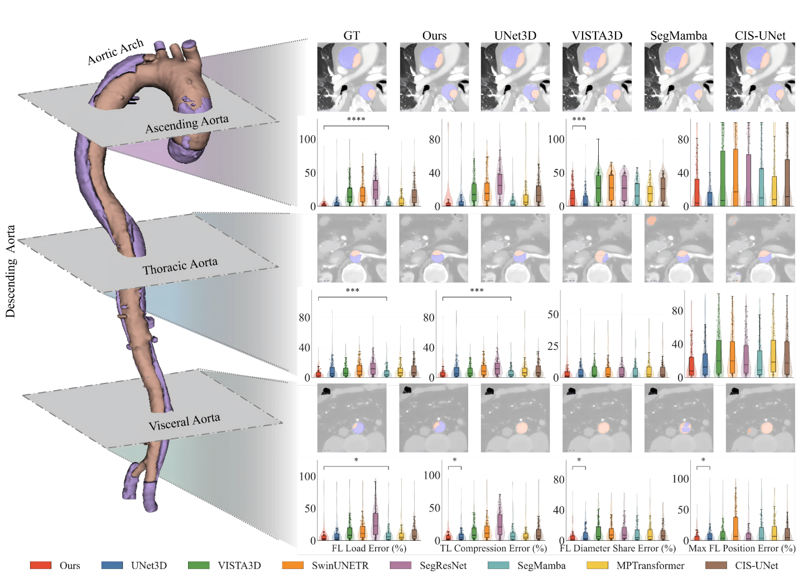

# AortaSeg

> A block-based pipeline for aortic lumen segmentation, domain inversion, and test-time adaptation.

AortaSeg is a compact research codebase for aortic CTA segmentation. It is designed for robust true-lumen and false-lumen segmentation under multicenter domain shift, with a workflow that covers volume-of-interest extraction, block-wise training, Fourier-based appearance alignment, and test-time adaptation.

<p align="center">
  
</p>
<p align="center"><em>Figure 3. Overview of the AortaSeg framework, extracted from the manuscript draft.</em></p>

## Highlights

- Clean repository layout with `scripts/` for runnable entry points and `aortaseg/` for reusable library code
- Source-domain training pipeline for 3D block-based segmentation
- Aorta VOI cropping and block generation with TotalSegmentator fallback handling
- Source-like block generation for domain inversion experiments
- Test-time adaptation pipeline with lumen prior refinement and paired metric reporting

## Paper Snapshot

The figures and summary tables below are extracted or condensed from the manuscript draft `ER-AortaSeg.docx` so the repository homepage can show the method, data coverage, and headline results directly on GitHub.

<p align="center">
  
  
</p>
<p align="center"><em>Figure 1. Aortic dissection variability and generalisable segmentation target. Figure 2. Multi-level domain shift between TAAD and external cohorts.</em></p>

### Cohort Overview

Condensed from Table 1 in the manuscript.

| Cohort | Role | Cases | Coverage | Source |
| --- | --- | ---: | --- | --- |
| imageTAAD | In-distribution training and validation | 120 | Full aorta | Public |
| imageTBAD | External OOD1 test cohort | 100 | Preoperative type-B CTA | Public |
| AVT-AD | External OOD2 test cohort | 4 | Whole-body aortic tree | Public |
| ANZHEN | External OOD3 test cohort | 38 | Thoracic aorta | Private |

### Headline Segmentation Results

Condensed from Table 2. Values below report AortaSeg performance across the internal TAAD set and three external cohorts.

| Cohort | TL Dice | FL Dice | TL HD95 (mm) | FL HD95 (mm) | TL ASSD (mm) | FL ASSD (mm) |
| --- | ---: | ---: | ---: | ---: | ---: | ---: |
| TAAD | 0.9174 | 0.9005 | 3.65 | 12.74 | 1.23 | 3.37 |
| TBAD | 0.8092 | 0.7597 | 18.13 | 25.76 | 5.15 | 7.21 |
| AVT-AD | 0.7263 | 0.8612 | 29.08 | 10.70 | 4.66 | 2.30 |
| ANZHEN | 0.8802 | 0.8713 | 10.10 | 19.70 | 2.10 | 4.01 |

### External Test-Time Adaptation Summary

Condensed from the TTA block at the end of Table 2.

| Metric | Before TTA | After TTA | Gain |
| --- | ---: | ---: | --- |
| mDice | 0.7655 | 0.7835 | +0.0181 `[+0.0104, +0.0257]` |
| mIoU | 0.6331 | 0.6563 | +0.0232 `[+0.0149, +0.0310]` |
| mSensitivity | 0.8045 | 0.8243 | +0.0198 `[+0.0101, +0.0286]` |
| mPPV | 0.7426 | 0.7597 | +0.0171 `[+0.0090, +0.0252]` |

<p align="center">
  
  
</p>
<p align="center"><em>Figure 4. Qualitative segmentation examples across in-distribution and out-of-distribution cohorts. Figure 5. Segment-based clinical error comparison across competing models.</em></p>

### Clinical Geometry Error Snapshot

Condensed from Table 4. These metrics summarize how well AortaSeg recovers clinically relevant false-lumen burden and geometry.

| Metric | AortaSeg Value |
| --- | --- |
| FLRE | `5.32%` `(95% CI: 4.20–6.44)` |
| FLVE | `30.55%` `(95% CI: 23.77–37.33)` |
| MFLDE | `27.63%` `(95% CI: 17.67–37.59)` |
| MFLPE | `1.62%` `(95% CI: 1.28–1.95)` |
| TAVE | `15.97%` `(95% CI: 13.18–18.75)` |

## Repository Layout

```text
AortaSeg/
├── assets/
│   └── readme/
│       ├── figure-1-variability.png
│       ├── figure-2-domain-shift.png
│       ├── figure-3-framework.png
│       ├── figure-4-qualitative-analysis.png
│       └── figure-5-clinical-errors.png
├── aortaseg/
│   ├── __init__.py
│   ├── data.py
│   ├── evaluation.py
│   ├── losses.py
│   ├── metrics.py
│   ├── model.py
│   └── utils.py
├── scripts/
│   ├── VOIandBlock_TS.py
│   ├── domain_inversion.py
│   ├── train_sourceCTA_block.py
│   └── ttaCTA_t.py
├── README.md
└── requirements.txt
```

## Workflow

```text
Raw CTA
  ↓
VOI Crop + Block Generation
  ↓
Source Training
  ↓
Domain Inversion
  ↓
Test-Time Adaptation
  ↓
Final AortaSeg Prediction
```

## Main Entry Points

| Script | Purpose |
| --- | --- |
| `scripts/VOIandBlock_TS.py` | Crop the aorta region and export block-level `.npz` files |
| `scripts/train_sourceCTA_block.py` | Train the source-domain AortaSeg model |
| `scripts/domain_inversion.py` | Generate source-like blocks for domain inversion |
| `scripts/ttaCTA_t.py` | Run test-time adaptation on target-domain blocks |

## Core Package

| Module | Responsibility |
| --- | --- |
| `aortaseg/model.py` | 3D AortaSeg network definition |
| `aortaseg/data.py` | Block dataset loading and dataloader creation |
| `aortaseg/losses.py` | Segmentation loss definitions |
| `aortaseg/metrics.py` | Dice, IoU, sensitivity, PPV, HD95, ASSD |
| `aortaseg/evaluation.py` | Case-level reconstruction and evaluation |
| `aortaseg/utils.py` | GPU wait utility and post-processing helpers |

## Installation

Create a Python environment and install the required packages:

```bash
pip install -r requirements.txt
```

Optional dependencies:

- `totalsegmentator` is used by `scripts/VOIandBlock_TS.py`
- `pandas` and `openpyxl` are only needed when reading spacing information from Excel

## Quick Start

### 1. Build Aortic Blocks

```bash
python scripts/VOIandBlock_TS.py \
  --data_dir ./data/raw \
  --output_dir ./data/blocks
```

### 2. Train AortaSeg

```bash
python scripts/train_sourceCTA_block.py \
  --data_dir ./data/blocks \
  --checkpoint_dir ./artifacts/AortaSeg
```

### 3. Generate Source-Like Blocks

```bash
python scripts/domain_inversion.py \
  --blocks_dir ./data/blocks \
  --checkpoint ./artifacts/AortaSeg/aortaseg_best.pth \
  --output_blocks_dir ./data/source_like_blocks
```

### 4. Run Test-Time Adaptation

```bash
python scripts/ttaCTA_t.py \
  --checkpoint ./artifacts/AortaSeg/aortaseg_best.pth \
  --s_data_dir ./data/source_like_blocks \
  --t_data_dir ./data/blocks
```

## Notes

- Run all commands from the repository root.
- The `scripts/` entry points automatically resolve the project root, so `python scripts/...` works directly.
- Large outputs such as checkpoints, NIfTI predictions, plots, and CSV artifacts are excluded from Git tracking through `.gitignore`.
- The README figures and summary tables are extracted or condensed from the manuscript draft to make the GitHub homepage more informative.

## Status

This repository is intentionally kept minimal: the current version focuses on the core AortaSeg pipeline and removes unrelated historical experiments and output artifacts from version control.
